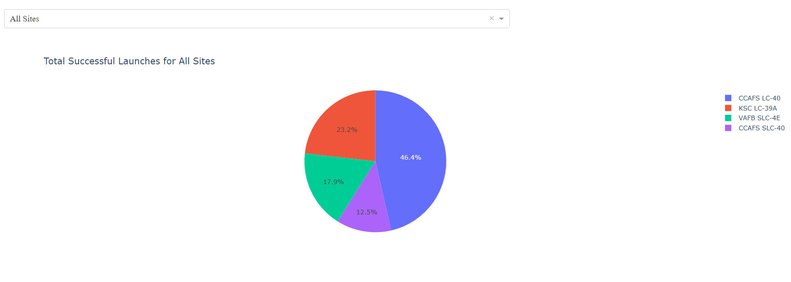
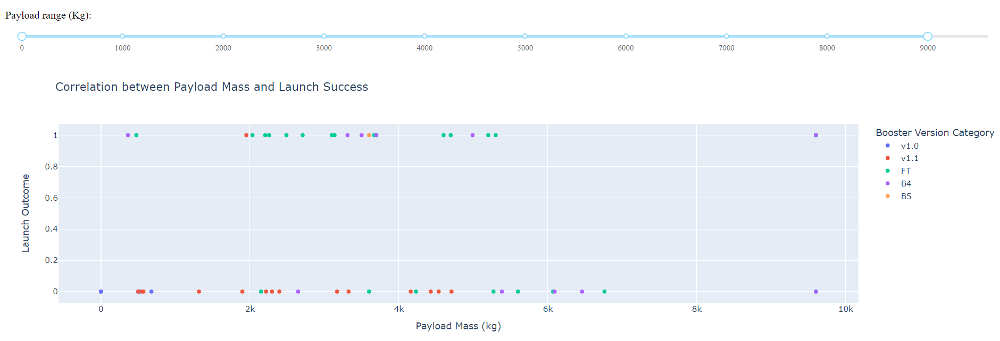

# SpaceX Launch Records Dashboard

This repository contains a dashboard application built using Dash and Plotly libraries in Python. The dashboard visualizes SpaceX launch records, allowing users to explore data related to launch sites, payload mass, and launch success.

## Features

### 1. Launch Site Selection Dropdown

- Users can select a launch site from a dropdown list.
- Options include:
  - All Sites
  - CCAFS LC-40
  - CCAFS SLC-40
  - KSC LC-39A
  - VAFB SLC-4E

### 2. Total Successful Launches Pie Chart

- Displays the total count of successful launches for all sites or for a specific selected site.

### 3. Payload Range Slider

- Allows users to select a payload range using a slider.
- The range can be adjusted to filter data based on payload mass.

### 4. Payload vs. Launch Success Scatter Chart

- Shows the correlation between payload mass and launch success.
- Users can filter data by both launch site and payload range.

## Setup Instructions

1. Clone this repository to your local machine.
2. Ensure you have Python installed on your system.
3. Install the required libraries by running:

    ```python

        pip install pandas dash plotly

    ```

4. Run the application by executing the following command:

    ```python

        python space_dash_app.py

    ```

5. Open a web browser and navigate to http://127.0.0.1:8050/ to view the dashboard.

## Usage

- Select a launch site from the dropdown list.
- Adjust the payload range using the slider to filter data.
- Explore the pie chart and scatter chart to analyze SpaceX launch records.

## Screenshots

### Total Successful Launches for All Sites



### Correlation between Payload Mass and Launch Success



## Credits

- This project is based on data provided by SpaceX and utilizes Dash and Plotly libraries.
- Created by **Tadesse Abateneh**.

## License

This project is licensed under the [MIT License](LICENSE).